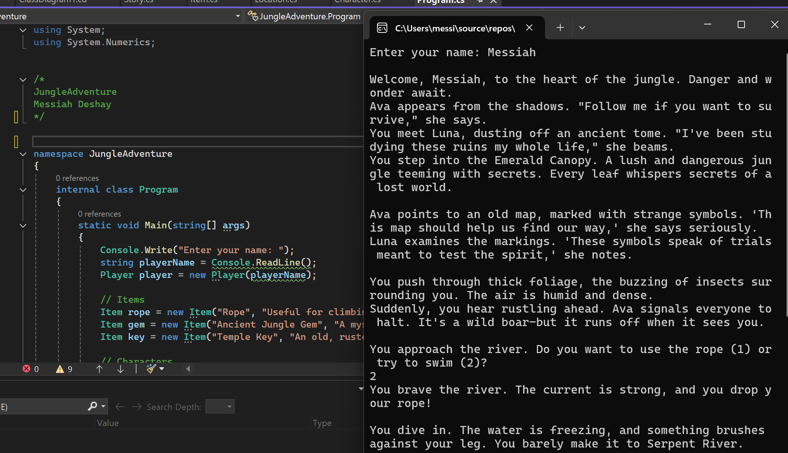
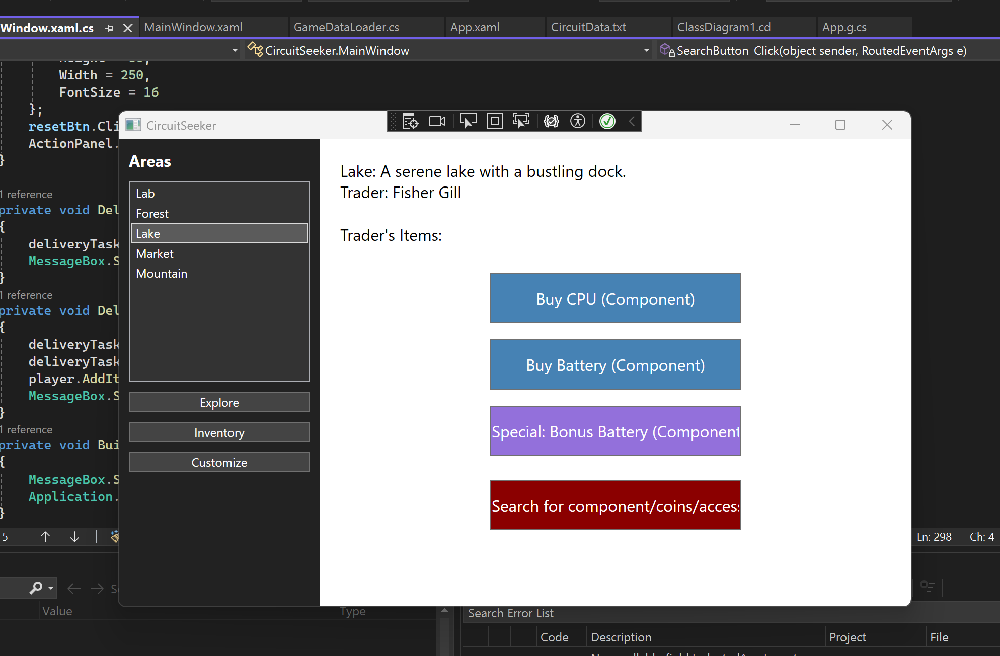
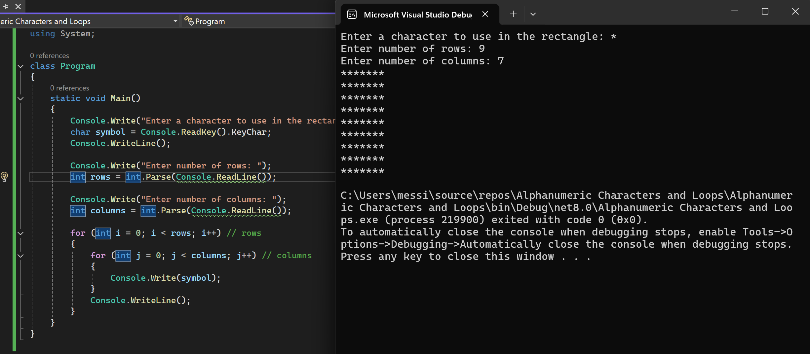
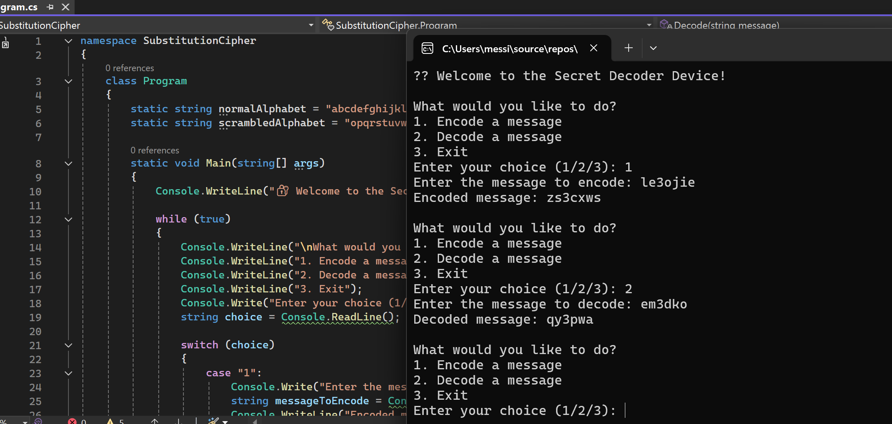
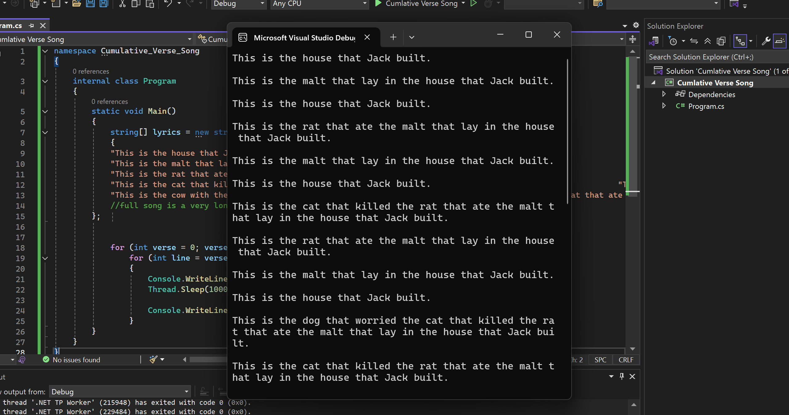

## 🧭 Jungle Adventure (Project Two)
My text-based adventure game called Jungle Adventure. You explore the Jungle with your friends, interact with other characters, and find a Jungle Gem!  

**Concepts I Used:** Console programming, OOP, Input Handling

---

## 🪟 CircuitSeeker (Project Three)
This project brings the adventure game into a GUI using WPF. Explore 5 areas and discover robot parts needs to assembly a robot!  

**Skills I Used:** WPF, Encapsulation, GUI logic, Simplified initialization

---

## 🔤 Design with Alphanumeric Characters and Loops
This project involved generating dynamic visual patterns using only characters and loops.  

**Skills Used:** Data Conversion, Nested Loops, console output formatting

---

## 🔐 Substitution Cipher
A program that encrypts and decrypts messages using a custom alphanumeric substitution system!  

**Skills Used:** String, Substitution Cipher Logic, Methods

---

## 🎵 Cumulative Verse Song
So this program that builds a cumulative-style song (“This is the house that Jack built”).  

**Concepts I Used:** Nested loops, Arrays

